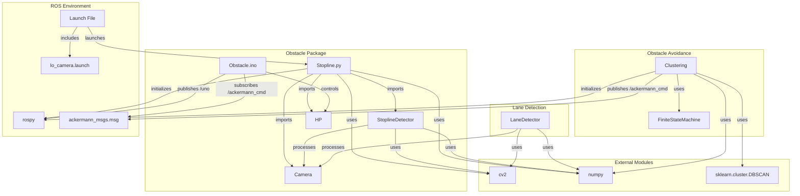

# 자율 주행 시스템 프로젝트

이 프로젝트는 ROS(로봇 운영 체제)를 기반으로 한 자율 주행 시스템으로, 카메라와 LiDAR 데이터를 활용하여 차선 감지, 정지선 감지, 장애물 회피 기능을 구현합니다. 자율 주행 차량의 핵심 기능을 통합적으로 테스트하고 개발할 수 있는 플랫폼을 제공합니다.

---

## 목차

- [주요 기능](#주요-기능)
- [프로젝트 구조](#프로젝트-구조)
- [ROS란 무엇인가](#ros란-무엇인가)
- [ROS 사용 이유](#ros-사용-이유)
- [프로젝트 장단점](#프로젝트-장단점)

---

## 주요 기능

- **차선 감지**: 카메라 영상에서 차선을 추적하여 주행 경로를 생성.
- **정지선 감지**: 카메라 영상을 통해 정지선을 인식하고 주행 제어에 반영.
- **장애물 회피**: LiDAR 데이터를 분석하여 장애물을 감지하고 회피 조향각을 계산.
- **차량 제어**: 속도와 조향각을 조절하여 자율 주행 수행.

---

## 프로젝트 구조

## ROS란 무엇인가

ROS(Robot Operating System)는 로봇 소프트웨어 개발을 위한 오픈소스 프레임워크입니다. 하드웨어 추상화, 드라이버, 메시지 통신, 패키지 관리 등 로봇 애플리케이션 개발에 필요한 도구와 라이브러리를 제공합니다. ROS는 분산 시스템으로 동작하며, 노드(Node) 간 토픽(Topic)을 통해 데이터를 주고받습니다.

주요 특징:
- 모듈화: 독립적인 노드로 기능을 분리 가능.
- 통신: 퍼블리시/구독 모델로 데이터 교환.
- 확장성: 다양한 센서와 플랫폼 지원.

## ROS 사용 이유

이 프로젝트에서 ROS를 사용한 이유는 다음과 같습니다:

- 모듈화와 재사용성: 각 기능(차선 감지, 장애물 회피 등)을 독립적인 노드로 개발하여 유지보수와 확장이 용이합니다.
- 센서 통합: 카메라, LiDAR, Arduino 등 다양한 하드웨어를 토픽으로 쉽게 연결 가능.
- 시뮬레이션 지원: CARLA, Gazebo와 같은 시뮬레이터와의 호환성으로 테스트가 간편.
- 커뮤니티와 생태계: ROS의 풍부한 라이브러리와 커뮤니티 지원으로 개발 속도 향상.

## 프로젝트 장단점
장점
- 모듈화 구조: 각 모듈이 독립적이어서 기능 추가 및 수정이 용이.
- ROS 기반: 다양한 하드웨어와 소프트웨어 통합이 쉬움.
- 확장 가능성: 시뮬레이터 및 추가 센서와의 연동 가능.
- 실시간 처리: 카메라와 LiDAR 데이터를 실시간으로 처리하여 자율 주행 구현.

단점
- 복잡성: ROS 초보자에게는 학습 곡선이 존재.
- 의존성: ROS와 특정 라이브러리에 의존하므로 환경 설정이 복잡할 수 있음.
- 미완성 부분: Stopline.py에서 StoplineDetector 호출이 비활성화된 상태로, 통합이 완전히 이루어지지 않음.
- 문서화 부족: 일부 토픽(예: 카메라 토픽) 명확히 정의되지 않음.

### 모듈 연결 다이어그램

