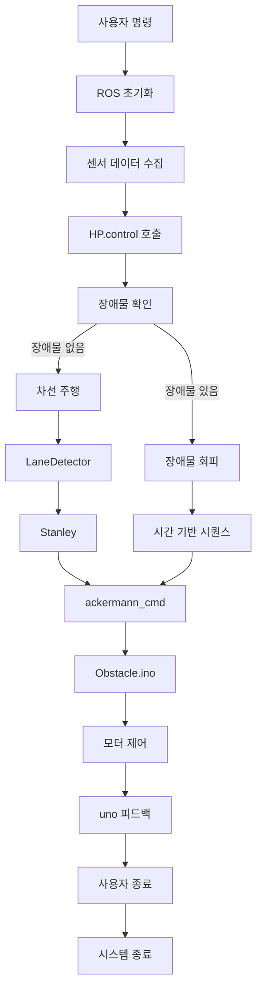

# 자율 주행 시스템 프로젝트

이 프로젝트는 ROS(로봇 운영 체제)를 기반으로 한 자율 주행 시스템으로, 카메라와 LiDAR 데이터를 활용하여 차선 감지, 정지선 감지, 장애물 회피 기능을 구현합니다. 아두이노를 통해 하드웨어 제어를 통합하며, 다양한 모듈이 협력하여 차량을 제어합니다.

---

## 프로젝트 일정
  

## 프로젝트 수행
  
  https://www.youtube.com/watch?v=FwGlec1eLXw&t=5435
  
  https://www.youtube.com/watch?v=FwGlec1eLXw&t=6775
  
## 목차
- [시스템 개요](#시스템-개요)
- [제어 흐름](#제어-흐름)
- [모듈 다이어그램](#모듈-다이어그램)
- [모듈 설명](#모듈-설명)
  - [Obstacle Package](#obstacle-package)
  - [Lane Detection](#lane-detection)
  - [Obstacle Avoidance](#obstacle-avoidance)
  - [Horse Power Control](#horse-power-control)
  - [ROS Environment](#ros-environment)
---

## 시스템 개요
- **목표**: 카메라로 차선과 정지선을 감지하고, LiDAR로 장애물을 탐지하여 차량을 안전하게 주행시키는 시스템.
- **구성 요소**:
  - **카메라**: 차선 및 정지선 감지.
  - **LiDAR**: 장애물 감지 및 회피.
  - **아두이노**: 모터 제어 및 피드백.
  - **ROS**: 모듈 간 통신 및 데이터 처리.
- **주요 기능**:
  - 차선 추적 (Stanley 제어).
  - 정지선 감지 및 정차.
  - 장애물 회피 (FSM 기반 상태 전이).

---

## 제어 흐름

---

## 모듈 다이어그램

```mermaid
graph TD
    subgraph "Obstacle Package"
        Stopline[Stopline.py] -->|imports| StoplineDetector[stopline_detector.py]
        Stopline -->|imports| HP[horse_power.py - HP]
        Stopline -->|imports| Camera[camera.py - Camera]
        StoplineDetector -->|processes| Camera
        ObstacleINO[Obstacle.ino] -->|controls via /ackermann_cmd| HP
    end

    subgraph "Lane Detection"
        LaneDetector[LaneDetector] -->|processes| Camera
    end

    subgraph "Obstacle Avoidance"
        Clustering[Clustering] -->|uses| FSM[FSM.py - FiniteStateMachine]
    end

    subgraph "Horse Power Control"
        HP -->|uses| LaneDetector
        HP -->|uses| Clustering
        HP -->|uses| HPSensor[horse_power_sensor.py - HPSensor]
        HP -->|uses| Stanley[controller.py - Stanley]
    end

    subgraph "ROS Environment"
        Launch[Launch File] -->|launches| Stopline
        Launch -->|includes| LoCamera[lo_camera.launch]
        Stopline -->|initializes| ROSPY[rospy]
        HP -->|initializes| ROSPY
        Clustering -->|initializes| ROSPY
        HP -->|publishes /ackermann_cmd| Ackermann[AckermannDriveStamped]
        Clustering -->|publishes /ackermann_cmd| Ackermann
        ObstacleINO -->|subscribes /ackermann_cmd| Ackermann
        ObstacleINO -->|publishes /uno| ROSPY
        HPSensor -->|subscribes /camera0/usb_cam/image_raw| Image[sensor_msgs.msg.Image]
        HPSensor -->|subscribes /scan_filtered| LaserScan[sensor_msgs.msg.LaserScan]
        HPSensor -->|subscribes /ultrasonic| Int32MultiArray[std_msgs.msg.Int32MultiArray]
    end

    subgraph "External Modules"
        ROSPY[rospy]
        Ackermann[ackermann_msgs.msg]
        CV2[cv2]
        NP[numpy]
        SKLearn[sklearn.cluster.DBSCAN]
        TIME[time]
        MATH[math]
        CVBridge[cv_bridge.CvBridge]
        Image[sensor_msgs.msg.Image]
        LaserScan[sensor_msgs.msg.LaserScan]
        Int32MultiArray[std_msgs.msg.Int32MultiArray]
    end

    subgraph "Arduino Environment"
        ObstacleINO -->|uses| CarLibrary[Car_Library.h]
    end

    Stopline -->|uses| CV2
    Stopline -->|uses| NP
    StoplineDetector -->|uses| CV2
    StoplineDetector -->|uses| NP
    LaneDetector -->|uses| CV2
    LaneDetector -->|uses| NP
    Clustering -->|uses| NP
    Clustering -->|uses| SKLearn
    HP -->|uses| CV2
    HP -->|uses| TIME
    Camera -->|uses| CV2
    Camera -->|uses| NP
    FSM -->|uses| TIME
    HPSensor -->|uses| CVBridge
    HPSensor -->|uses| NP
    Stanley -->|uses| MATH
    Stanley -->|uses| NP

```

## 모듈 설명
# Obstacle Package
- Stopline.py:
    - 역할: 메인 노드로 시스템 실행을 담당.
    - 기능: HP를 호출하여 차량 제어 루프 실행, 아두이노 코드 업로드 기능 포함 (현재 주석 처리).
    - 의존성: horse_power.py, stopline_detector.py, camera.py, cv2, numpy.
    - 
      

  
- stopline_detector.py - StoplineDetector:
    - 역할: 카메라 이미지에서 정지선 감지.
    - 기능: 윤곽선 분석으로 정지선 탐지, 감지 여부 반환.
    - 의존성: camera.py, cv2, numpy.
    -
    - 

  
- Obstacle.ino:
    - 역할: ROS 메시지를 받아 모터 제어 및 가변저항 값 피드백.
    - 기능: /ackermann_cmd 구독으로 속도/조향각 적용, /uno로 가변저항 값 퍼블리시.
    - 의존성: Car_Library.h.
    - 
      

# Lane Detection
- LaneDetector:
    - 역할: 카메라 이미지에서 차선 감지 및 조향각 계산.
    - 기능: Bird's Eye View 변환 후 차선 곡률 계산.
    - 의존성: camera.py, cv2, numpy.
    - 
      

  
# Obstacle Avoidance
- Clustering:
    - 역할: LiDAR 데이터로 장애물 클러스터링 및 회피 조향각 계산.
    - 기능: DBSCAN으로 장애물 군집화, FSM으로 회피 방향 결정.
    - 의존성: FSM.py, numpy, sklearn.cluster.DBSCAN.
    - ROS: /ackermann_cmd 퍼블리시.
    - 
      

- FSM.py - FiniteStateMachine:
    - 역할: 장애물 감지 횟수 기반 상태 전이.
    - 기능: FollowLane, AvoidLeft, AvoidRight 상태 관리.
    - 의존성: time.
    - 
      
  
# Horse Power Control
- horse_power.py - HP:
    - 역할: 차량 제어 통합 (차선 주행 + 장애물 회피).
    - 기능:LaneDetector로 차선 추적.
        - Clustering으로 장애물 회피.
        - Stanley로 조향각 보정.
        - 시간 기반 회피 시퀀스 실행.
    - 의존성: LaneDetector, Clustering, horse_power_sensor.py, controller.py, cv2, time.
    - ROS: /ackermann_cmd 퍼블리시.
    - 
      
  
- horse_power_sensor.py - HPSensor:
    - 역할: 센서 데이터 수집 (카메라, LiDAR, 초음파).
    - 기능: ROS 토픽 구독으로 데이터 저장 (real_cam, cam, lidar_filtered, ultra).
    - 의존성: cv_bridge, numpy.
    - ROS: /camera0/usb_cam/image_raw, /scan_filtered, /ultrasonic 구독.
    - 
      

- controller.py - Stanley:
    - 역할: Stanley 제어 알고리즘으로 조향각 계산.
    - 기능: 횡방향 오차와 곡률 기반 조향각 반환 (PID는 미사용).
    - 의존성: math, numpy.
    - 
      

  
# ROS Environment
- 토픽:
    - /ackermann_cmd: HP와 Clustering에서 퍼블리시, Obstacle.ino에서 구독.
    - /uno: Obstacle.ino에서 퍼블리시.
    - /camera0/usb_cam/image_raw: HPSensor에서 카메라 이미지 수신.
    - /scan_filtered: HPSensor에서 LiDAR 데이터 수신.
    - /ultrasonic: HPSensor에서 초음파 데이터 수신.
- 런치 파일: Stopline.py 실행 및 카메라 설정(lo_camera.launch).
